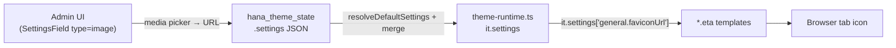

# Thêm Favicon cho Insurance Theme

## Tổng quan

Hiện tại insurance theme chưa có favicon. Cần:
1. Thêm field `faviconUrl` vào `settingsSchema` trong [`themes/theme-insurance/src/index.ts`](themes/theme-insurance/src/index.ts)
2. Render `<link rel="icon">` trong `<head>` của 4 layout templates

Không cần thay đổi core, types, hay admin UI — field kiểu `image` đã được hỗ trợ đầy đủ (media picker, lưu DB, render trong `SettingsField.vue`).

## Các thay đổi cần thực hiện

### 1. Thêm field vào settings schema

**File:** [`themes/theme-insurance/src/index.ts`](themes/theme-insurance/src/index.ts)

Trong section `general`, thêm field sau `logoUrl`:

```ts
{
  key: 'faviconUrl',
  label: 'Favicon',
  type: 'image',
  description: 'Browser tab icon (ICO, PNG 32×32 hoặc SVG)',
  accept: ['image/x-icon', 'image/png', 'image/svg+xml'],
},
```

### 2. Thêm favicon tag vào 4 templates

Sau `<link rel="stylesheet">` trong `<head>`, thêm dòng này vào **tất cả** 4 file:

```eta
<% if (it.settings['general.faviconUrl']) { %><link rel="icon" href="<%= it.settings['general.faviconUrl'] %>"><% } %>
```

**Files cần sửa:**

- [`themes/theme-insurance/templates/home.eta`](themes/theme-insurance/templates/home.eta) — dòng 7
- [`themes/theme-insurance/templates/post.eta`](themes/theme-insurance/templates/post.eta) — dòng 9
- [`themes/theme-insurance/templates/category.eta`](themes/theme-insurance/templates/category.eta) — dòng 9
- [`themes/theme-insurance/templates/404.eta`](themes/theme-insurance/templates/404.eta) — dòng 7

## Luồng dữ liệu



## Scope

Chỉ 5 file thay đổi — không ảnh hưởng core, types, hay blog theme.
