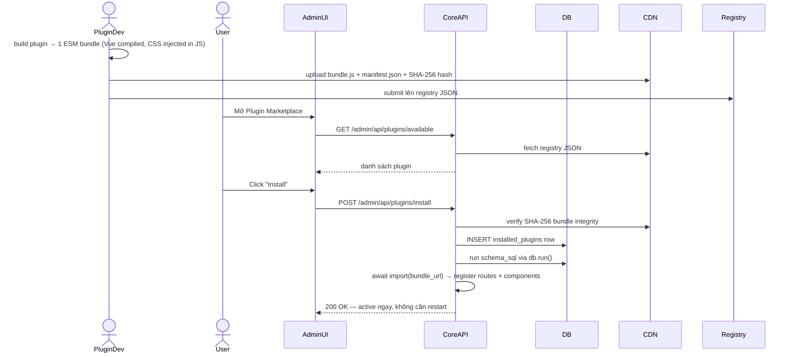
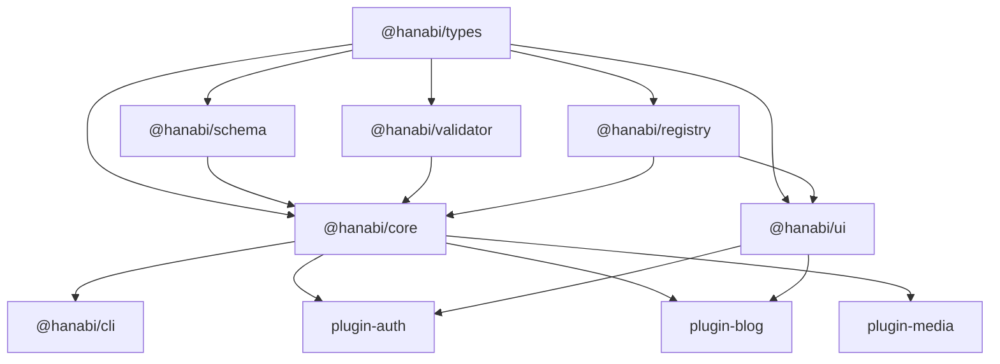

# Hanabi CMS Framework — Setup Plan (03/2026)

## Đánh giá kiến trúc gốc

Kiến trúc gốc rất tốt và đúng hướng. Em có một số gợi ý cải tiến, đặc biệt về tooling stack sau khi đã research lại theo thời điểm 03/2026.

---

## Gợi ý cải tiến

### 1. Bổ sung thêm 3 packages thiết yếu

`**@hanabi/types**` (packages/types) — Package riêng cho TypeScript interfaces/types dùng chung:

- Tránh circular dependency giữa `core`, `ui`, và các plugins
- Mọi plugin đều import types từ đây, không import từ `core`

`**@hanabi/validator**` (packages/validator) — Zod schemas dùng chung:

- Validate input trên cả API layer và Admin UI layer
- Plugin có thể extend schema validation

`**@hanabi/config**` (packages/config) — Shared tooling config:

- `tsconfig.base.json` dùng chung toàn monorepo
- `biome.json` dùng chung (thay ESLint + Prettier)

### 2. Bunup thay vì tsup/tsdown (quan trọng)

**Tóm tắt tình trạng 03/2026:**

- `tsup` — vẫn maintain (~6M downloads/tuần) nhưng dựa trên esbuild, không còn là lựa chọn tối ưu
- `tsdown` — successor của tsup, dựa trên Rolldown (Rust), nhanh hơn ~3-5x. Dành cho **Node.js environments**
- `bunup` — dựa trên **Bun's native bundler**, nhanh nhất hiện tại (37ms vs tsup 5.4s = nhanh hơn ~9x)

**Kết luận: Nếu dev bằng Bun thì không cần tsdown.** Bunup là lựa chọn tự nhiên vì:

- Tận dụng Bun runtime sẵn có, không cần install thêm gì
- Tự động generate `.d.ts` (hỗ trợ `isolatedDeclarations` cho tốc độ nhanh hơn 50-100x)
- Tự động cập nhật `package.json#exports` field
- Built-in workspace support — một file `bunup.config.ts` ở root quản lý build cho **tất cả packages**:

```typescript
// bunup.config.ts ở root
import { defineWorkspace } from 'bunup'

export default defineWorkspace([
  { name: 'types',     root: 'packages/types' },
  { name: 'validator', root: 'packages/validator' },
  { name: 'schema',    root: 'packages/schema' },
  { name: 'core',      root: 'packages/core', config: { format: ['esm', 'cjs'] } },
  { name: 'ui',        root: 'packages/ui' },
  { name: 'cli',       root: 'packages/cli', config: { format: ['esm'] } },
], {
  format: ['esm'],  // shared default
})
```

### 3. Bun workspaces thay pnpm workspaces

Vì full Bun stack, dùng Bun workspaces (khai báo trong `package.json`) thay `pnpm-workspace.yaml`:

```json
// package.json (root)
{
  "workspaces": ["packages/*", "plugins/*", "apps/*"]
}
```

Turborepo vẫn đứng trên để orchestrate task caching/parallelism, Bun chỉ đóng vai package manager.

### 4. Biome v2 thay ESLint + Prettier

Biome v2 (ra tháng 6/2025, hiện tại v2.4) có thêm:

- **Type-aware linting** mà không cần TypeScript compiler — rất phù hợp cho monorepo lớn
- **Multi-file analysis** — lint rules có thể query thông tin từ file khác
- 459 rules từ ESLint, TypeScript ESLint, và các nguồn khác
- Formatter nhanh hơn Prettier ~35x, tương thích 97%

### 5. `bun test` thay Vitest

Bun có built-in test runner tương thích Jest API. Không cần cài thêm Vitest:

- `bun test` chạy tất cả `*.test.ts` files
- Hỗ trợ `describe`, `it`, `expect`, `mock`, `spyOn`
- Nhanh hơn Vitest vì chạy native trên Bun runtime

### 6. Plugin API phong phú hơn (Lifecycle Hooks)

Thay vì chỉ `setupRoutes`, interface `CMSPlugin` nên có đầy đủ lifecycle:

```typescript
interface CMSPlugin {
  name: string
  version: string
  schema?: Record<string, AnyTable>
  hooks?: {
    'cms:init'?: (cms: HanabiCMS) => void | Promise<void>
    'cms:ready'?: (app: Hono) => void | Promise<void>
    'admin:register'?: (registry: ComponentRegistry) => void
  }
  routes?: (app: Hono) => void
}
```

Dùng simple hook registry (không cần EventEmitter) để tránh coupling chặt.

### 7. Plugin System — Hybrid Architecture (Official + Community)

**Hai loại plugin với cơ chế phân phối khác nhau:**

- **Official plugins** (`@hanabi/`*): NPM package, `bun add` + restart một lần, full Drizzle type-safe schema, có thể dùng external npm deps
- **Community plugins**: CDN/S3 ESM bundle, **dynamic import — không cần restart**, schema là raw SQL string, phải self-bundle mọi dependency, serverless-friendly

---

**Luồng Community Plugin (Dynamic, không restart):**




---

**Cách Vue template + CSS hoạt động trong dynamic bundle:**

Plugin build thành 1 file ESM duy nhất, `bunup` tự inject CSS vào JS:

```typescript
// Auto-generated bundle output
const _css = `.post-card { padding: 1rem; }`
if (typeof document !== 'undefined') {
  const el = document.createElement('style')
  el.textContent = _css
  document.head.appendChild(el)
}
// Vue SFC đã compile thành render functions
export const PostCard = { render() { /* compiled */ } }
export const routes = (app) => { app.get('/posts', ...) }
export const schemaSql = [`CREATE TABLE IF NOT EXISTS posts (...)`]
```

Admin UI dùng `defineAsyncComponent` để load Vue component từ CDN:

```typescript
const PostCard = defineAsyncComponent(() =>
  import(/* @vite-ignore */ plugin.bundleUrl).then(m => m.PostCard)
)
```

---

`**@hanabi/registry**` (packages/registry):

- `fetchAvailablePlugins()` — fetch registry JSON từ CDN (GitHub Pages host được)
- `installPlugin({ bundle_url, integrity_hash })` — verify SHA-256, ghi DB, chạy schema SQL, dynamic import
- `uninstallPlugin(name)` — xoá DB record, drop tables (nếu user confirm), unregister routes
- `verifyBundle(url, hash)` — từ chối bundle không có chữ ký hợp lệ

### 8. `apps/playground` thay vì plugin-sample + site-sample

Gộp làm một để tránh phức tạp. `apps/playground`:

- Dùng `workspace:`* reference đến local packages — không cần simulate npm install
- Có sẵn 1 sample plugin viết tay để test plugin API
- Chạy như một site thật với đủ plugins
- Đây là môi trường dev/test chính trong quá trình phát triển

```
apps/playground/
├── src/
│   ├── index.ts            # Entry: khởi tạo HanabiCMS với sample plugins
│   └── plugins/
│       └── sample-plugin/  # Plugin viết tay để test plugin API
├── hanabi.config.ts
└── package.json            # deps: workspace:* references
```

### 9. Thêm `apps/docs` + `plugin-media`

- `apps/docs` — **VitePress** để viết docs từ sớm. Framework không có docs thì khó adoption.
- `plugin-media` — File upload (local / S3-compatible) là must-have cho mọi CMS.

### 10. Migration CLI command

Drizzle không tự merge migrations — cần tích hợp vào CLI:

```bash
npx hanabi migrate   # Thu thập schema từ core + plugins → generate + apply migration
```

---

## Cấu trúc Monorepo Đề xuất

```
hanabi-cms/
├── packages/
│   ├── core/           # @hanabi/core — Hono engine, Plugin system, DB bridge
│   ├── types/          # @hanabi/types — Shared TS interfaces
│   ├── validator/      # @hanabi/validator — Zod schemas
│   ├── schema/         # @hanabi/schema — Drizzle base tables & merge helper
│   ├── registry/       # @hanabi/registry — Plugin marketplace client (MỚI)
│   ├── ui/             # @hanabi/ui — Vue base components + Plugin Marketplace UI
│   ├── config/         # @hanabi/config — tsconfig.base.json, biome.json
│   └── cli/            # @hanabi/cli — hanabi init / migrate / plugin install
├── plugins/
│   ├── plugin-auth/    # @hanabi/plugin-auth
│   ├── plugin-blog/    # @hanabi/plugin-blog
│   └── plugin-media/   # @hanabi/plugin-media
├── apps/
│   ├── admin/          # Vue admin app → build vào core/dist/admin
│   ├── playground/     # Dev test env: sample plugin + full site (MỚI, thay 2 apps)
│   ├── docs/           # VitePress documentation
│   └── starter/        # Template project để clone
├── .changeset/
├── bunup.config.ts     # Root workspace build config
├── biome.json
├── package.json        # workspaces field
└── turbo.json
```

---

## Tooling Stack (03/2026)

- **Runtime & Package Manager**: Bun
- **Server**: Hono (multi-runtime: Bun / Node / Cloudflare Workers)
- **Database**: Drizzle ORM (SQLite/Turso local, PostgreSQL production)
- **Frontend**: Vue 3 + Vite
- **Build (packages)**: `bunup` — Bun-native, nhanh nhất, thay cả tsup lẫn tsdown
- **Lint + Format**: `Biome v2` — type-aware, 35x nhanh hơn Prettier
- **Test**: `bun test` — built-in, không cần Vitest
- **Version/Publish**: `@changesets/cli`
- **Monorepo**: Turborepo (task orchestration) + Bun workspaces (package management)

---

## Dependency Graph (Packages)




---

## Kế hoạch triển khai theo phase

**Phase 1 — Scaffold monorepo** (`packages/config`, Turborepo, Biome v2, Bunup workspace config, Bun workspaces)

**Phase 2 — Core engine** (`packages/types`, `packages/core`: HanabiCMS class, Plugin registry, Hook system)

**Phase 3 — Database layer** (`packages/schema`: base tables + `installed_plugins` table, schema merge helper, migration CLI)

**Phase 4 — Official plugins** (`plugin-auth`, `plugin-blog`, `plugin-media`)

**Phase 5 — Admin UI + Plugin Marketplace** (`apps/admin` Vue app, build + embed vào core, Component Registry, `packages/registry` + Plugin Marketplace page)

**Phase 6 — Playground** (`apps/playground`: sample plugin + full site test environment)

**Phase 7 — CLI + Docs** (`packages/cli`: init/migrate/plugin commands, `apps/docs`: VitePress)