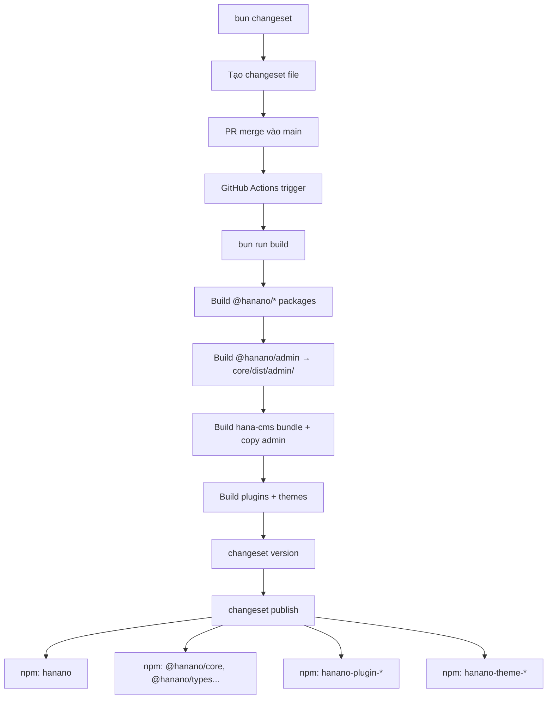

# NPM Publish Flow — Hana CMS

## Prerequisite — Tạo npm org `@hanano`

Các core packages dùng scope `@hanano/`, cần tạo npm org trước:
1. Đăng nhập npmjs.com → "Create Organization" → tên `hanano`
2. Thêm `NPM_TOKEN` vào GitHub Secrets

---

## Mục tiêu

| Publish lên npm | Không publish |
|---|---|
| `hanano` (umbrella + admin dist) | `@hanano/cli`, `@hanano/config` (private) |
| `@hanano/core`, `@hanano/schema`, `@hanano/types`, `@hanano/validator`, `@hanano/ui`, `@hanano/registry` | `@hanano/admin`, `@hanano/docs`, `@hanano/starter` |
| `hanano-plugin-auth`, `hanano-plugin-blog`, `hanano-plugin-menu`, `hanano-plugin-pages` | |
| `hanano-theme-blog`, `hanano-theme-insurance` | |

---

## 1. Đổi scope toàn project `@hana/` → `@hanano/`

Đây là bước đầu tiên, trước khi làm bất kỳ thứ gì khác.

**Approach:** PowerShell one-liner global find-replace trên toàn bộ text files (loại trừ `bun.lock`, `node_modules`, `dist`):

```powershell
Get-ChildItem -Path "d:\projects\cms" -Recurse `
  -Include "*.ts","*.vue","*.json","*.md","*.mdc","*.html","*.yaml","*.yml","*.toml" |
  Where-Object {
    $_.FullName -notmatch "\\node_modules\\" -and
    $_.FullName -notmatch "\\dist\\" -and
    $_.FullName -notmatch "\\.turbo\\"
  } |
  ForEach-Object {
    $content = Get-Content $_.FullName -Raw -Encoding UTF8
    if ($content -match "@hana/") {
      $newContent = $content -replace "@hana/", "@hanano/"
      Set-Content $_.FullName $newContent -NoNewline -Encoding UTF8
    }
  }
```

Sau khi chạy:
- `bun install` — regenerate `bun.lock`
- `bun run build` — verify build không bị broken

**Tổng số files bị ảnh hưởng:** ~100 files, ~443 occurrences (không tính `bun.lock`).

---

## 2. Tạo `packages/hanano/` — umbrella package

`hanano` là entry point cho người dùng cuối: re-export từ `@hanano/*`, bao gồm admin dist, và expose CLI bin.

**`packages/hanano/package.json`**
```json
{
  "name": "hanano",
  "version": "0.1.0",
  "type": "module",
  "exports": {
    ".": {
      "import": "./dist/index.js",
      "types": "./dist/index.d.ts"
    },
    "./admin": "./dist/admin/index.html",
    "./admin/*": "./dist/admin/*"
  },
  "bin": { "hanano": "./dist/cli.js" },
  "files": ["dist"],
  "dependencies": {
    "@hanano/core": "workspace:*",
    "@hanano/schema": "workspace:*",
    "@hanano/types": "workspace:*",
    "@hanano/validator": "workspace:*",
    "@hanano/ui": "workspace:*",
    "@hanano/registry": "workspace:*",
    "@hanano/cli": "workspace:*"
  }
}
```

**`packages/hanano/src/index.ts`**
```ts
export * from '@hanano/core'
export * from '@hanano/schema'
export * from '@hanano/types'
export * from '@hanano/validator'
export * from '@hanano/ui'
export * from '@hanano/registry'
```

**`packages/hanano/src/cli.ts`**
```ts
export * from '@hanano/cli'
```

**`packages/hanano/bunup.config.ts`**
```ts
import { cp } from 'node:fs/promises'
import { defineConfig } from 'bunup'

export default defineConfig([
  {
    entry: ['src/index.ts'],
    format: ['esm'],
    dts: true,
    external: [/^@hanano\//, 'drizzle-orm', 'hono', 'eta', /^@tiptap\//],
    onSuccess: async () => {
      await cp('../core/dist/admin', 'dist/admin', { recursive: true })
    },
  },
  {
    entry: ['src/cli.ts'],
    format: ['esm'],
    dts: false,
    external: [/^@hanano\//, 'drizzle-orm', /^@drizzle-kit/],
  },
])
```

**`packages/hanano/turbo.json`**
```json
{
  "extends": ["//"],
  "tasks": {
    "build": {
      "dependsOn": ["@hanano/admin#build", "^build"]
    }
  }
}
```

---

## 3. Đánh dấu packages không publish là private

Chỉ đánh `"private": true` cho 2 packages:
- [`packages/cli/package.json`](packages/cli/package.json) — CLI expose qua `hanano` bin, không publish riêng
- [`packages/config/package.json`](packages/config/package.json) — chỉ chứa tsconfig

(`@hanano/admin`, `@hanano/docs`, `@hanano/starter` đã `private: true` rồi.)

Các packages còn lại (`@hanano/core`, `@hanano/schema`, `@hanano/types`, `@hanano/validator`, `@hanano/ui`, `@hanano/registry`) **vẫn publish** để plugins có thể depend vào.

---

## 4. Đổi tên plugins

Sau khi bước 1 (rename scope) chạy xong, workspace name của plugins là `@hanano/plugin-*`. Chỉ cần đổi thêm field `"name"` sang tên npm:

| Tên workspace (sau rename) | Tên publish lên npm |
|---|---|
| `@hanano/plugin-auth` | `hanano-plugin-auth` |
| `@hanano/plugin-blog` | `hanano-plugin-blog` |
| `@hanano/plugin-menu` | `hanano-plugin-menu` |
| `@hanano/plugin-pages` | `hanano-plugin-pages` |

Khi changesets publish, `workspace:*` deps (`@hanano/types`, `@hanano/validator`...) tự động resolve thành version thực trong published `package.json`.

---

## 5. Đổi tên themes

| Tên workspace (sau rename) | Tên publish lên npm |
|---|---|
| `@hanano/theme-blog` | `hanano-theme-blog` |
| `@hanano/theme-insurance` | `hanano-theme-insurance` |

---

## 5. Cập nhật Changesets config

[`.changeset/config.json`](.changeset/config.json):
```json
{
  "changelog": "@changesets/cli/changelog",
  "commit": false,
  "fixed": [],
  "linked": [
    ["@hanano/core", "@hanano/schema", "@hanano/types", "@hanano/validator", "@hanano/ui", "@hanano/registry"]
  ],
  "access": "public",
  "baseBranch": "main",
  "updateInternalDependencies": "patch",
  "ignore": [
    "@hanano/cli", "@hanano/config",
    "@hanano/admin", "@hanano/docs", "@hanano/starter"
  ]
}
```

- `linked`: các core packages versioned cùng nhau
- Packages có thể publish: `hanano`, `@hanano/core`, `@hanano/schema`, `@hanano/types`, `@hanano/validator`, `@hanano/ui`, `@hanano/registry`, `hanano-plugin-*`, `hanano-theme-*`

---

## 6. Thêm publish task vào `turbo.json` (root)

```json
{
  "tasks": {
    "publish": {
      "dependsOn": ["build"],
      "cache": false
    }
  }
}
```

---

## 7. Thêm `.npmrc`

```ini
# .npmrc
access=public
```

---

## 8. GitHub Actions — publish workflow

Tạo `.github/workflows/publish.yml` theo pattern Changesets:
- Trigger: push lên `main`
- Bước 1: `bun run build` (turbo, skip docs)
- Bước 2: Changesets action — tạo "Version Packages" PR hoặc publish trực tiếp nếu có changeset
- Cần secret `NPM_TOKEN` trong GitHub repo

---

## Luồng publish hoàn chỉnh



---

## Lưu ý quan trọng

**Thứ tự thực hiện:**
1. Chạy PowerShell rename (bước 1) trước tất cả
2. `bun install` để regenerate lock file
3. Verify build: `bun run build`
4. Mới bắt đầu tạo `packages/hana-cms/` và các bước còn lại

**Về npm org `@hanano`**: Cần tạo org `@hanano` trên npmjs.com (free) trước khi publish lần đầu.

**Changeset files cũ**: Nếu có file nào trong `.changeset/` tham chiếu `@hana/*`, xóa và tạo lại sau khi rename.
