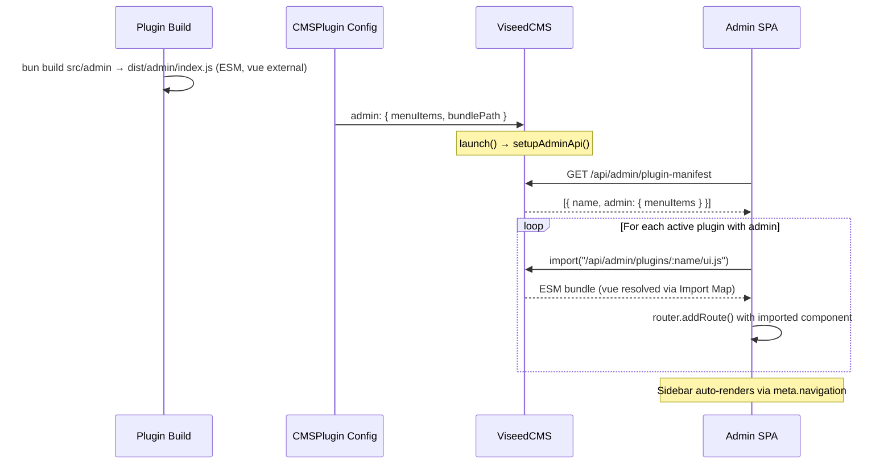
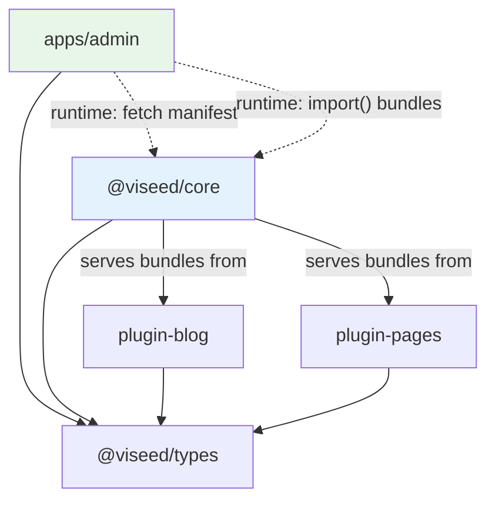

# Plugin Admin Menu Registration System (v2 -- Runtime Dynamic Import)

## Design Principle

**Admin SPA has zero dependency on any plugin package.** Official plugins and community plugins use the exact same flow: plugin self-builds its admin UI as an ESM bundle, core serves it, admin dynamically imports it at runtime. No rebuild of admin needed when plugins change.

## Current State

- Admin sidebar derives menus from Vue Router `meta.navigation` -- 6 static entries in [apps/admin/src/router/routes.ts](apps/admin/src/router/routes.ts)
- `CMSPlugin` has no `admin` field -- plugins can only register server-side API routes, schemas, and hooks
- `admin:register` hook exists in types but is **never called** anywhere in core
- Plugins have zero ability to add pages or menus to the admin UI

## Architecture



## Layer 1: Server-Side Manifest + Bundle Serving

### 1.1 New types in `@viseed/types`

Add to [packages/types/src/plugin.ts](packages/types/src/plugin.ts):

```typescript
export interface PluginAdminMenuItem {
  id: string
  label: string
  icon: string
  path: string                       // admin route path, e.g. '/blog/posts'
  requiredPermissions?: Permission[]
  siteScoped?: boolean
  order?: number                     // lower = higher in sidebar
}

export interface PluginAdminConfig {
  menuItems: PluginAdminMenuItem[]
  bundlePath?: string                // absolute path to compiled admin ESM bundle
}
```

Extend `CMSPlugin`:

```typescript
export interface CMSPlugin {
  name: string
  version: string
  schema?: Record<string, unknown>
  hooks?: Partial<CMSPluginHooks>
  routes?: (app: Hono, helpers: CMSRouteContextHelpers) => void
  lifecycle?: PluginLifecycle
  admin?: PluginAdminConfig           // NEW
}
```

### 1.2 Manifest API -- `GET /api/admin/plugin-manifest`

In [packages/core/src/viseed-cms.ts](packages/core/src/viseed-cms.ts) `setupAdminApi()`, add after existing `GET /plugins`:

```typescript
registerAdminRoute('GET', '/plugin-manifest', 'site.content.read', (c) => {
  const manifest = this.plugins
    .filter(p => p.admin && this.pluginRegistry.isActive(p.name))
    .map(p => ({
      name: p.name,
      version: p.version,
      admin: {
        menuItems: p.admin!.menuItems,
        hasBundle: !!p.admin!.bundlePath,
      },
    }))
  return c.json({ plugins: manifest })
})
```

Note: `bundlePath` (filesystem path) is NOT exposed to the client. Only `hasBundle: boolean` is returned.

### 1.3 Bundle serving -- `GET /api/admin/plugins/:name/ui.js`

New public admin route in [packages/core/src/viseed-cms.ts](packages/core/src/viseed-cms.ts):

```typescript
registerAdminRoute('GET', '/plugins/:name/ui.js', 'site.content.read', async (c) => {
  const name = c.req.param('name')
  const plugin = this.plugins.find(p => p.name === name)

  if (!plugin?.admin?.bundlePath) {
    return c.json({ error: 'No admin bundle for this plugin' }, 404)
  }
  if (!this.pluginRegistry.isActive(name)) {
    return c.json({ error: 'Plugin is not active' }, 404)
  }

  const file = Bun.file(plugin.admin.bundlePath)
  if (!(await file.exists())) {
    return c.json({ error: 'Admin bundle file not found' }, 404)
  }

  return new Response(await file.arrayBuffer(), {
    headers: {
      'Content-Type': 'application/javascript; charset=utf-8',
      'Cache-Control': 'public, max-age=3600',
    },
  })
})
```

## Layer 2: Plugin Admin Bundles

### 2.1 Build strategy

Each plugin with admin UI adds a **separate build step** for its admin components. The build:
- Compiles `.vue` SFC files into JS render functions
- Outputs a single ESM bundle
- Marks `vue` and `vue-router` as **external** (resolved by admin's Import Map at runtime)

Build command (added to plugin's `package.json` scripts):

```bash
bun build src/admin/index.ts --outdir dist/admin --format esm --external vue --external vue-router --target browser
```

Since `bun build` does not natively compile `.vue` SFC files, plugins use a small `build-admin.ts` script that invokes Vite in library mode:

```typescript
// plugins/plugin-blog/build-admin.ts
import { build } from 'vite'
import vue from '@vitejs/plugin-vue'

await build({
  plugins: [vue()],
  build: {
    lib: {
      entry: 'src/admin/index.ts',
      formats: ['es'],
      fileName: 'index',
    },
    outDir: 'dist/admin',
    emptyOutDir: true,
    rollupOptions: {
      external: ['vue', 'vue-router'],
    },
  },
})
```

Script in `package.json`:

```json
"scripts": {
  "build": "bunup",
  "build:admin": "bun run build-admin.ts"
}
```

Turborepo `turbo.json` can add a `build:admin` task that depends on `build`.

### 2.2 Plugin-blog admin views

Create `plugins/plugin-blog/src/admin/`:

```
plugins/plugin-blog/src/admin/
  index.ts              → export { default as PostsView } from './PostsView.vue'
                          export { default as CategoriesView } from './CategoriesView.vue'
  PostsView.vue         → CRUD list for blog posts (/api/blog/posts)
  CategoriesView.vue    → CRUD list for categories (/api/blog/categories)
```

Add `admin` field to `blogPlugin()` in [plugins/plugin-blog/src/index.ts](plugins/plugin-blog/src/index.ts):

```typescript
import { resolve, dirname } from 'node:path'
import { fileURLToPath } from 'node:url'

const __dirname = dirname(fileURLToPath(import.meta.url))

export function blogPlugin(): CMSPlugin {
  return {
    name: 'blog',
    version: '0.1.0',
    schema: blogSchema,
    admin: {
      menuItems: [
        {
          id: 'blog-posts',
          label: 'Posts',
          icon: '✎',
          path: '/blog/posts',
          siteScoped: true,
          requiredPermissions: ['site.content.read'],
          order: 20,
        },
        {
          id: 'blog-categories',
          label: 'Categories',
          icon: '▤',
          path: '/blog/categories',
          siteScoped: true,
          requiredPermissions: ['site.content.read'],
          order: 21,
        },
      ],
      bundlePath: resolve(__dirname, '../admin/index.js'),
    },
    // ...existing hooks, routes
  }
}
```

### 2.3 Plugin-pages admin views

Same pattern. Create `plugins/plugin-pages/src/admin/`:

```
plugins/plugin-pages/src/admin/
  index.ts       → export { default as PagesView } from './PagesView.vue'
  PagesView.vue  → CRUD list for pages (/api/pages)
```

Admin config:

```typescript
admin: {
  menuItems: [
    {
      id: 'pages',
      label: 'Pages',
      icon: '☰',
      path: '/pages',
      siteScoped: true,
      requiredPermissions: ['site.content.read'],
      order: 15,
    },
  ],
  bundlePath: resolve(__dirname, '../admin/index.js'),
},
```

### 2.4 Plugin dependencies

Both plugins add these **devDependencies** (only needed for `build:admin`):

```json
"devDependencies": {
  "vue": "^3.5.0",
  "@vitejs/plugin-vue": "^5.2.0",
  "vite": "^6.2.0"
}
```

Vue is **NOT** a runtime dependency -- it's only used at build time to compile SFC templates. At runtime, the browser resolves `vue` via the Import Map.

### 2.5 Bundle export contract

Every plugin admin bundle MUST export Vue components as **named exports** matching the `path` in `menuItems`. The convention:

```typescript
// Plugin admin bundle exports
export { default as PostsView } from './PostsView.vue'
export { default as CategoriesView } from './CategoriesView.vue'
```

Admin resolves components by convention: for a menu item with `path: '/blog/posts'`, the component name is derived as `PostsView` (last path segment, PascalCase + "View"). OR the `menuItems` can include an explicit `componentName` field:

```typescript
export interface PluginAdminMenuItem {
  // ...existing fields
  componentExport?: string  // name of the export in the admin bundle, e.g. 'PostsView'
}
```

This way admin knows exactly which export to grab from the bundle.

## Layer 3: Admin SPA Integration (Zero Plugin Dependencies)

### 3.1 Import Map for Vue sharing

The core challenge: plugin admin bundles `import { ref } from 'vue'` -- the browser needs to resolve `vue` to the same Vue instance used by admin.

Solution: **ES Import Map** in admin's `index.html`.

Update [apps/admin/vite.config.ts](apps/admin/vite.config.ts):

```typescript
import vue from '@vitejs/plugin-vue'
import { defineConfig } from 'vite'

export default defineConfig({
  base: '/admin/',
  plugins: [vue(), viseedImportMapPlugin()],
  build: {
    outDir: '../../packages/core/dist/admin',
    emptyOutDir: true,
    rollupOptions: {
      output: {
        manualChunks: {
          'vendor-vue': ['vue'],
        },
      },
    },
  },
  server: {
    proxy: { '/api': 'http://localhost:3000' },
  },
})
```

`viseedImportMapPlugin()` is a small Vite plugin that:
1. At build time: finds the Vue chunk filename (e.g., `vendor-vue-abc123.js`)
2. Injects `<script type="importmap">` into `index.html` before other scripts:

```html
<script type="importmap">
{
  "imports": {
    "vue": "/admin/assets/vendor-vue-abc123.js"
  }
}
</script>
```

3. During dev: points `vue` to `/@fs/node_modules/vue/dist/vue.esm-bundler.js` or similar

This ensures plugin admin bundles' `import from 'vue'` resolves to the exact same Vue instance as admin.

### 3.2 Manifest fetching composable

Create `apps/admin/src/composables/usePluginManifest.ts`:

- `fetchPluginManifest()` -- calls `GET /api/admin/plugin-manifest`
- Returns array of `{ name, admin: { menuItems, hasBundle } }`
- Cached in memory, re-fetched on page refresh

### 3.3 Dynamic route registration

In [apps/admin/src/main.ts](apps/admin/src/main.ts), after router creation and before `app.mount()`:

```typescript
async function registerPluginAdminRoutes(router: Router) {
  const manifest = await fetchPluginManifest()

  for (const plugin of manifest.plugins) {
    // Dynamic import the plugin's admin bundle from core
    let pluginModule: Record<string, unknown> | null = null
    if (plugin.admin.hasBundle) {
      try {
        pluginModule = await import(
          /* @vite-ignore */ `/api/admin/plugins/${plugin.name}/ui.js`
        )
      } catch (err) {
        console.warn(`Failed to load admin bundle for plugin "${plugin.name}"`, err)
      }
    }

    for (const item of plugin.admin.menuItems) {
      const componentExport = item.componentExport ?? deriveComponentName(item.path)
      const component = pluginModule?.[componentExport] ?? GenericPluginView

      router.addRoute({
        path: item.path,
        component,
        meta: {
          requiresAuth: true,
          requiredPermissions: item.requiredPermissions,
          siteScoped: item.siteScoped,
          navigation: { label: item.label, icon: item.icon },
          order: item.order,
          pluginName: plugin.name,
        },
      })
    }
  }
}
```

Key points:
- `import(/* @vite-ignore */ url)` -- dynamic ESM import from API URL
- Browser resolves `vue` in the loaded bundle via Import Map
- If bundle fails to load or component not found, falls back to `GenericPluginView`
- **Admin never imports from `@viseed/plugin-*`** -- it imports from a URL served by core

### 3.4 GenericPluginView fallback

Create `apps/admin/src/views/GenericPluginView.vue`:

A simple view that shows the plugin name and "Custom admin UI not available". This ensures menu items always render even if the plugin doesn't ship a bundle. Can be enhanced later to auto-generate CRUD from plugin API.

### 3.5 Sidebar ordering

Update `navItems` computed in [AdminLayout.vue](apps/admin/src/layouts/AdminLayout.vue):
- Read `meta.order` from route meta
- Static routes get explicit orders in [routes.ts](apps/admin/src/router/routes.ts): Dashboard=0, Content=10, Media=30, Plugins=90, Themes=91, Sites=92
- Plugin routes use their declared `order`
- Sort `navItems` by `order`

Result sidebar:

```
Dashboard       (order: 0)
Content         (order: 10)
Pages           (order: 15, from plugin-pages)
Posts           (order: 20, from plugin-blog)
Categories      (order: 21, from plugin-blog)
Media           (order: 30)
---
Plugins         (order: 90, platform-only)
Themes          (order: 91, platform-only)
Sites           (order: 92, platform-only)
```

## Dependency Graph

Admin has **zero dependency** on any plugin. All plugin UI is loaded at runtime.



## Files Changed Summary

- **`@viseed/types`**: `plugin.ts` -- add `PluginAdminConfig`, `PluginAdminMenuItem`, `componentExport` field; `index.ts` -- re-export new types
- **`@viseed/core`**: `viseed-cms.ts` -- add `GET /plugin-manifest` and `GET /plugins/:name/ui.js` endpoints
- **`plugin-blog`**: `index.ts` -- add `admin` config with `bundlePath`; new `src/admin/` directory with Vue views; new `build-admin.ts`; `package.json` -- add `build:admin` script + vue/vite devDeps
- **`plugin-pages`**: same pattern as plugin-blog
- **`apps/admin`**: `vite.config.ts` -- add `manualChunks` + import map plugin; `main.ts` -- add dynamic route registration; new `usePluginManifest.ts` composable; new `GenericPluginView.vue`; `AdminLayout.vue` -- add order sorting; `routes.ts` -- add `order` to existing route metas
- **`turbo.json`**: add `build:admin` task
- **Rules**: update `05-plugin-api-contract.mdc` and `03-package-map.mdc`
