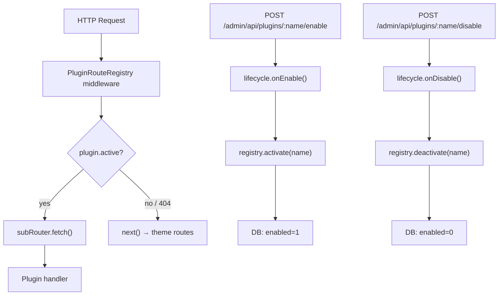
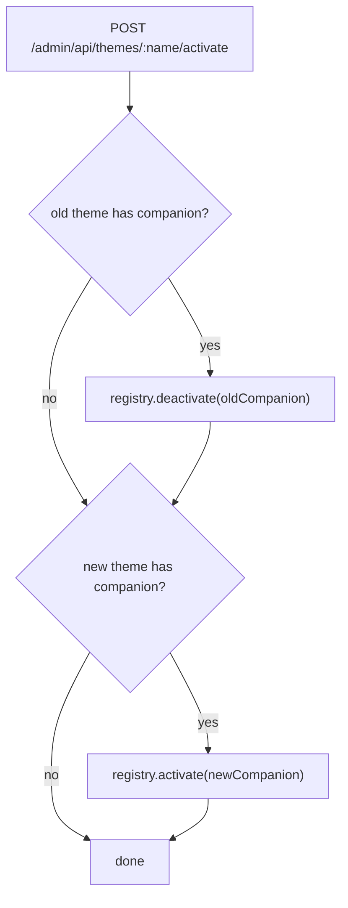

# Plugin Hot-swap & Theme Companion Plugin

## Tổng quan kiến trúc





## Phan 1 — Thay đổi types

### [`packages/types/src/plugin.ts`](packages/types/src/plugin.ts)

Thêm `lifecycle` vào `CMSPlugin`:

```typescript
export interface PluginLifecycle {
  onInstall?:   (db: DatabaseInstance) => void | Promise<void>
  onUninstall?: (db: DatabaseInstance) => void | Promise<void>
  onEnable?:    (cms: HanaCMS) => void | Promise<void>
  onDisable?:   (cms: HanaCMS) => void | Promise<void>
}

export interface CMSPlugin {
  name: string
  version: string
  schema?: Record<string, unknown>
  hooks?: Partial<CMSPluginHooks>
  routes?: (app: Hono, helpers: CMSRouteContextHelpers) => void
  lifecycle?: PluginLifecycle  // NEW
}
```

Thêm 2 hooks mới vào `CMSPluginHooks`:
```typescript
'plugin:enabled':  (pluginName: string) => void | Promise<void>
'plugin:disabled': (pluginName: string) => void | Promise<void>
```

### [`packages/types/src/theme.ts`](packages/types/src/theme.ts)

Thêm `companionPlugin` và `routePattern`:

```typescript
export interface ThemeLayoutEntry<TData = Record<string, unknown>> {
  template: string
  routePattern?: string  // override DEFAULT_LAYOUT_ROUTES, e.g. '/product/:slug'
  data?: (defaultData: TData, cms: HanaCMS) => TData | Promise<TData>
}

export interface CMSTheme {
  // ...existing fields...
  companionPlugin?: CMSPlugin  // auto-enabled when theme activates — full CMSPlugin, same interface
}
```

## Phan 2 — PluginRouteRegistry (file mới)

**[`packages/core/src/plugin-route-registry.ts`](packages/core/src/plugin-route-registry.ts)** — file mới hoàn toàn.

Đây là wrapper thay thế việc mount routes trực tiếp vào Hono:

```typescript
export class PluginRouteRegistry {
  private installed = new Map<string, { plugin: CMSPlugin; subRouter: Hono }>()
  private active = new Set<string>()

  register(plugin: CMSPlugin, helpers: CMSRouteContextHelpers): void
  activate(name: string): void
  deactivate(name: string): void
  isActive(name: string): boolean
  middleware(): MiddlewareHandler  // single Hono middleware, dispatch theo active set
}
```

`middleware()` logic:
- Iterate `installed` theo thứ tự đăng ký
- Chỉ dispatch tới plugin nằm trong `active` set
- Nếu `subRouter.fetch()` trả 404, tiếp tục `next()`

## Phan 3 — Thay đổi hana-cms.ts

**File:** [`packages/core/src/hana-cms.ts`](packages/core/src/hana-cms.ts)

### 3a. `launch()` — thay plugin.routes() direct mount

```typescript
// BEFORE
for (const plugin of this.plugins) {
  if (plugin.routes) {
    plugin.routes(this.app, this.createRouteContextHelpers())
  }
}

// AFTER
this.pluginRegistry = new PluginRouteRegistry()
for (const plugin of this.plugins) {
  this.pluginRegistry.register(plugin, this.createRouteContextHelpers())
}
// Đọc DB active state → pluginRegistry.activate() cho plugins có enabled=1
await this.syncPluginActiveStateFromDb()
this.app.use('*', this.pluginRegistry.middleware())
```

### 3b. Schema collection — gom cả companionPlugin schemas

```typescript
const allSchemas = [
  ...this.plugins.flatMap(p => p.schema ? [p.schema] : []),
  ...Array.from(this.themeRegistry.values())
    .flatMap(t => t.companionPlugin?.schema ? [t.companionPlugin.schema] : []),
]
this.db = await createDatabase(this.config.db, allSchemas)
```

companionPlugin schemas luôn migrate ở startup — giống plugin schemas. Khi theme activate chỉ toggle routes.

### 3c. Theme activation — toggle companionPlugin

Trong `activateTheme()` (đã có), thêm:
```typescript
// disable companionPlugin của theme cũ
if (previousTheme?.companionPlugin) {
  this.pluginRegistry.deactivate(previousTheme.companionPlugin.name)
  await previousTheme.companionPlugin.lifecycle?.onDisable?.(this)
}
// enable companionPlugin của theme mới — đầy đủ lifecycle như plugin thường
if (newTheme.companionPlugin) {
  if (!this.pluginRegistry.isInstalled(newTheme.companionPlugin.name)) {
    this.pluginRegistry.register(newTheme.companionPlugin, helpers)
  }
  await newTheme.companionPlugin.lifecycle?.onEnable?.(this)
  this.pluginRegistry.activate(newTheme.companionPlugin.name)
  // companion hooks cũng được đăng ký vào HookRegistry như plugin thường
  await this.registerPluginHooks(newTheme.companionPlugin)
}
```

### 3d. Thêm Admin API endpoints

Vào `setupAdminApi()`:

```
POST /admin/api/plugins/:name/install   → lifecycle.onInstall(db) + upsert DB record
POST /admin/api/plugins/:name/uninstall → lifecycle.onUninstall(db) + delete DB record
POST /admin/api/plugins/:name/enable    → lifecycle.onEnable(cms) + registry.activate() + DB enabled=1
POST /admin/api/plugins/:name/disable   → lifecycle.onDisable(cms) + registry.deactivate() + DB enabled=0
GET  /admin/api/plugins                 → list installed plugins với enabled status
```

### 3e. mountThemeRoutes() — hỗ trợ routePattern override

```typescript
for (const [layoutKey, layoutEntry] of Object.entries(activeTheme.layouts)) {
  const routePath = layoutEntry.routePattern ?? DEFAULT_LAYOUT_ROUTES[layoutKey]
  if (!routePath) continue  // custom layout key không có default route, bỏ qua
  this.app.get(routePath, async (c) => { /* existing render logic */ })
}
```

Với custom `routePattern` (vd `/product/:slug`): register tất cả custom routes từ mọi registered theme lúc startup, handler vẫn dùng `resolveThemeForRequest()` dynamic.

## Phan 4 — Ví dụ usage sau khi xong

```typescript
// themes/theme-ecommerce/src/index.ts
import { ecommerceCompanionPlugin } from './companion-plugin'

export function ecommerceTheme(): CMSTheme {
  return {
    name: 'ecommerce',
    companionPlugin: ecommerceCompanionPlugin(),  // full CMSPlugin: schema + routes + lifecycle + hooks
    layouts: {
      home:    { template: 'home.eta' },
      product: { template: 'product.eta', routePattern: '/product/:slug' },
      cart:    { template: 'cart.eta',    routePattern: '/cart' },
    }
  }
}

// companion-plugin.ts (nằm trong theme package, KHÔNG publish riêng)
export function ecommerceCompanionPlugin(): CMSPlugin {
  return {
    name: 'ecommerce-companion',
    version: '1.0.0',
    schema: { products, orders, cartItems },           // Drizzle tables
    routes: (app, helpers) => setupEcommerceRoutes(app, helpers), // Hono routes
    hooks: {
      'theme:beforeRender': async (ctx) => {            // inject data vào templates
        ctx.data.featuredProducts = await helpers.db.query.products.findMany(...)
      }
    },
    lifecycle: {
      onInstall:   async (db) => { /* custom seed nếu cần */ },
      onUninstall: async (db) => { /* drop hay keep tables — plugin tự quyết */ },
      onEnable:    async (cms) => { /* warm up cache, schedule jobs... */ },
      onDisable:   async (cms) => { /* clear cache, cancel jobs... */ },
    }
  }
}
```

## Files cần thay đổi

- [`packages/types/src/plugin.ts`](packages/types/src/plugin.ts) — thêm `PluginLifecycle`, 2 hooks mới
- [`packages/types/src/theme.ts`](packages/types/src/theme.ts) — thêm `companionPlugin`, `routePattern`
- `packages/core/src/plugin-route-registry.ts` — **file mới**
- [`packages/core/src/hana-cms.ts`](packages/core/src/hana-cms.ts) — launch(), schema collection, activateTheme(), admin APIs, mountThemeRoutes()
- [`packages/core/src/index.ts`](packages/core/src/index.ts) — export PluginRouteRegistry
- [`.cursor/rules/05-plugin-api-contract.mdc`](.cursor/rules/05-plugin-api-contract.mdc) — update lifecycle docs
- [`.cursor/rules/08-theme-api-contract.mdc`](.cursor/rules/08-theme-api-contract.mdc) — update companion concept, routePattern
- [`.cursor/rules/03-package-map.mdc`](.cursor/rules/03-package-map.mdc) — last updated
