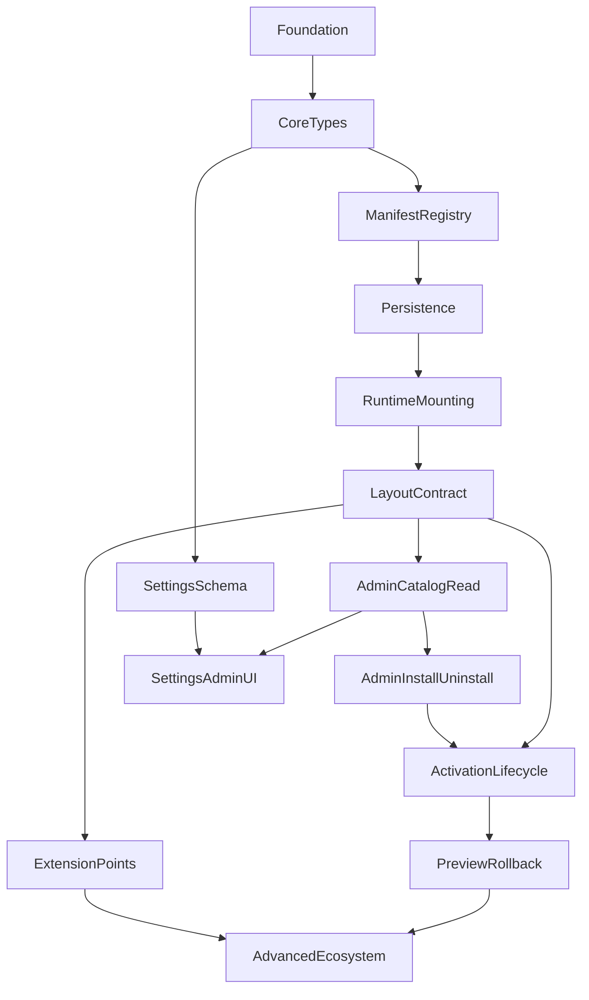

# Theme Plan Index

## Mục tiêu

Tách Theme system thành nhiều implementation plans nhỏ, mỗi plan chỉ giải quyết một concern kỹ thuật duy nhất và vẫn để chỗ cho các plan sau mở rộng.

## Thứ tự đề xuất

1. [theme_01_foundation.plan.md](theme_01_foundation.plan.md)
2. [theme_02_core_types.plan.md](theme_02_core_types.plan.md)
3. [theme_03_manifest_registry_contract.plan.md](theme_03_manifest_registry_contract.plan.md)
4. [theme_04_persistence.plan.md](theme_04_persistence.plan.md)
5. [theme_05_runtime_mounting.plan.md](theme_05_runtime_mounting.plan.md)
6. [theme_06_layout_contract.plan.md](theme_06_layout_contract.plan.md)
7. [theme_07_admin_catalog_read.plan.md](theme_07_admin_catalog_read.plan.md)
8. [theme_08_admin_install_uninstall.plan.md](theme_08_admin_install_uninstall.plan.md)
9. [theme_09_settings_schema.plan.md](theme_09_settings_schema.plan.md)
10. [theme_10_settings_admin_ui.plan.md](theme_10_settings_admin_ui.plan.md)
11. [theme_11_activation_lifecycle.plan.md](theme_11_activation_lifecycle.plan.md)
12. [theme_12_preview_rollback.plan.md](theme_12_preview_rollback.plan.md)
13. [theme_13_extension_points.plan.md](theme_13_extension_points.plan.md)
14. [theme_14_advanced_ecosystem.plan.md](theme_14_advanced_ecosystem.plan.md)

## Dependency Map

## Shared constraints

- Không model `Theme` như một `CMSPlugin` đặc biệt.
- Một thời điểm chỉ có một theme active.
- Các plan đầu phải additive, không phá plugin API hiện tại ở [packages/types/src/plugin.ts](../../packages/types/src/plugin.ts).
- Khi interface hoặc rule-level architecture thay đổi, phải cập nhật `.cursor/rules/` tương ứng trong cùng task implementation.

## Quyết định kiến trúc đã chốt

- **Rendering mechanism:** Eta templates + render function pattern.
  - Core đăng ký Hono routes theo layout keys, tự fetch default data phù hợp mỗi layout (ví dụ `post` → post data, `home` → recent posts).
  - Theme cung cấp `.eta` template files + optional `data()` hook để extend/override data trước khi render.
  - Output là HTML string — SEO-friendly, zero client JS mặc định.
  - Client-side interactivity (Vue/React) là **plugin concern**: `plugin-vue` hoặc `plugin-react` inject runtime + mount points vào HTML output. Không phải core hay theme responsibility.
  - Chi tiết type shapes xem plan 02 (`ThemeLayoutRenderer`, `LayoutContext`) và plan 06 (layout data contracts).

## Shared acceptance

- Sau mỗi plan, codebase vẫn build được theo scope nhỏ của plan đó.
- Mỗi plan có thể implement và review độc lập.
- Không plan nào buộc phải triển khai luôn toàn bộ marketplace, preview, settings, và slots cùng lúc.
